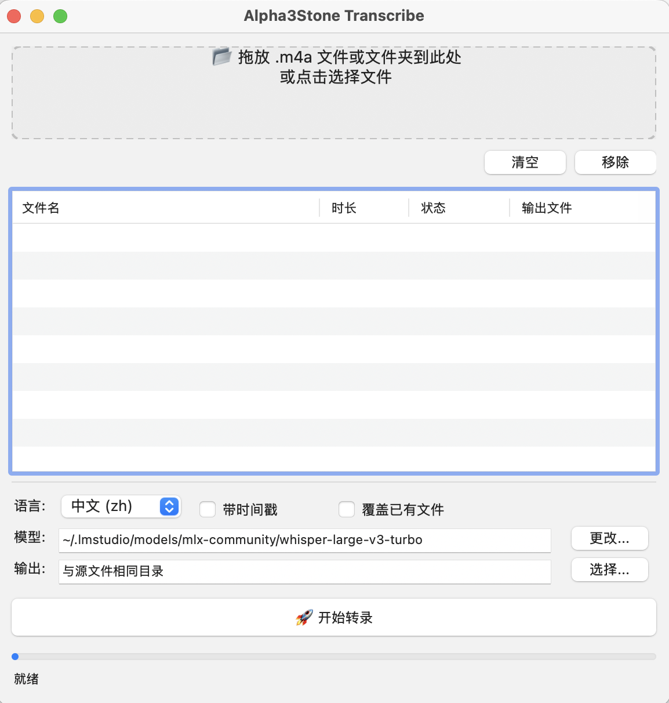

# Alpha3Stone Transcribe

macOS 原生音频转录应用，基于 [MLX Whisper](https://github.com/ml-explore/mlx-examples/tree/main/whisper) 运行在 Apple Silicon 上，支持中文和英文语音识别。

## 功能

- **拖放转录** — 将 .m4a / .mp3 / .wav / .flac 文件或文件夹拖入窗口即可开始
- **批量处理** — 支持同时转录多个文件，自动去重
- **多语言** — 支持中文（zh）、英文（en）及自动检测
- **时间戳模式** — 可输出带时间戳的文本或 SRT 字幕文件
- **无需联网** — 所有推理在本地 Apple Silicon GPU 上完成，数据不出机

## 截图

<p align="center">
  
</p>

## 系统要求

- macOS 13.0 或更高版本
- Apple Silicon（M1 / M2 / M3 / M4）

## 安装

从 [Releases](https://github.com/sungoku/Alpha3Stone-Transcribe/releases) 页面下载 `Alpha3Stone Transcribe.app`，解压后拖入「应用程序」文件夹即可。

首次打开时，macOS 会提示「无法验证开发者」，前往 **系统设置 → 隐私与安全性**，点击「仍要打开」。

## 使用方法

1. 启动应用
2. 将音频文件或文件夹拖入顶部的拖放区域，或点击区域选择文件
3. 在设置栏选择语言、是否带时间戳
4. 如需更换模型路径，点击「更改...」选择 MLX Whisper 模型目录
5. 点击「🚀 开始转录」
6. 转录完成后，输出文件保存在与源文件相同的目录下（.txt 或 .srt）

## 模型

首次使用需要下载 Whisper 模型。推荐使用 [LM Studio](https://lmstudio.ai/) 搜索并下载 `mlx-community/whisper-large-v3-turbo`，模型默认路径为：

```
~/.lmstudio/models/mlx-community/whisper-large-v3-turbo
```

也可以在应用内点击「更改...」选择其他 MLX Whisper 兼容模型。

## 从源码构建

```bash
# 创建 conda 环境（Python 3.10）
conda create -n transcribe python=3.10 -y
conda activate transcribe

# 安装依赖
pip install -r requirements.txt

# 打包为 .app
python setup.py py2app
```

生成的应用位于 `dist/Alpha3Stone Transcribe.app`。

## 技术栈

| 组件 | 说明 |
|------|------|
| [MLX Whisper](https://github.com/ml-explore/mlx-examples/tree/main/whisper) | Apple Silicon 上的 Whisper 推理引擎 |
| [PyObjC](https://pyobjc.readthedocs.io/) | 原生 macOS GUI（AppKit） |
| [py2app](https://py2app.readthedocs.io/) | 打包为独立 .app |

## 许可证

MIT License
